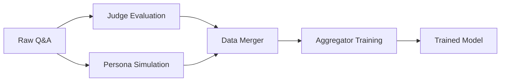

# Core Pipeline

This directory contains the core Multi-Judge Interpretability pipeline components. These are the fundamental building blocks used by all experiments.

## Structure

```
pipeline/
├── core/                       # Core pipeline components
│   ├── judge_creation.py      # Create/manage judges via Martian API
│   ├── judge_evaluation.py    # Evaluate samples with judges
│   ├── persona_simulation.py  # Simulate human feedback personas
│   └── aggregator_training.py # Train GAM/MLP aggregation models
└── utils/                      # Shared utilities
    ├── judge_rubrics.py       # Full judge rubric definitions
    └── data_merger.py         # Data merging utilities
```

## Core Components

### 1. Judge Creation (`judge_creation.py`)
Creates and manages 10 specialized judges via Martian API:
- Harmlessness, Privacy, Factual Accuracy, etc.
- Each judge evaluates on 0-4 scale
- Full rubrics in `utils/judge_rubrics.py`

```bash
python pipeline/core/judge_creation.py --list  # List all judges
python pipeline/core/judge_creation.py --update  # Update judge rubrics
```

### 2. Judge Evaluation (`judge_evaluation.py`)
Evaluates Q&A pairs using all judges:
- Parallel evaluation across 10 judges
- Checkpoint saving for large datasets
- Exponential backoff for API failures

```bash
python pipeline/core/judge_evaluation.py \
  --input dataset/data.pkl \
  --output dataset/data_with_scores.pkl \
  --max-workers 5
```

### 3. Persona Simulation (`persona_simulation.py`)
Simulates 8 diverse human personas:
- Professor, CEO, Novelist, Architect, etc.
- Generates preference scores (1-10)
- Uses Lambda AI via OpenAI interface

```bash
python pipeline/core/persona_simulation.py \
  --input dataset/data.pkl \
  --output dataset/data_with_feedback.pkl \
  --max-concurrent 10
```

### 4. Aggregator Training (`aggregator_training.py`)
Trains models to combine judge scores:
- GAM: Interpretable additive model
- MLP: Neural network for complex patterns
- Outputs trained model checkpoints

```bash
python pipeline/core/aggregator_training.py \
  --data dataset/complete_data.pkl \
  --model-type mlp \
  --output models/aggregator.pt
```

## Data Flow



## Usage in Experiments

Experiments import these components:

```python
from pipeline.core.judge_evaluation import JudgeEvaluator
from pipeline.core.aggregator_training import train_model
from pipeline.utils.data_merger import DataMerger

# Use in experiment
evaluator = JudgeEvaluator()
scores = evaluator.evaluate_parallel(question, answer)
```

## Configuration

Set environment variables in `.env`:
```bash
MARTIAN_API_KEY=your_key_here
OPEN_AI_API_KEY=lambda_api_key_here
```

## Data Format

All components use pandas DataFrames with these columns:
- `instruction`: Question/prompt
- `answer`: Model response
- `judge_scores`: List of 10 scores
- `human_feedback_score`: Aggregated human preference
- `persona_name`: Which persona provided feedback

## Best Practices

1. **Always use absolute imports** when importing from experiments
2. **Maintain backwards compatibility** when updating
3. **Document any API changes** in this README
4. **Use type hints** for better IDE support
5. **Keep components focused** - one responsibility each

## Testing Components

Test individual components:

```bash
# Test judge API connection
python pipeline/core/judge_creation.py --test

# Evaluate single sample
echo '{"instruction": "What is 2+2?", "answer": "4"}' | \
  python pipeline/core/judge_evaluation.py --stdin

# Quick training test
python pipeline/core/aggregator_training.py \
  --data dataset/data_with_judge_scores.pkl \
  --model-type mlp \
  --epochs 5 \
  --quick
```

## Component Dependencies

- `torch`: For model training
- `pandas`: Data manipulation
- `numpy`: Numerical operations
- `httpx`: Async API calls
- `martian-sdk-python`: Martian API client

## Extending the Pipeline

To add new components:
1. Create module in `pipeline/core/`
2. Follow existing patterns for data I/O
3. Add CLI interface for standalone use
4. Document in this README
5. Update experiments to use new component

## Version History

- v1.0: Initial refactored pipeline (Dec 2024)
- v1.1: Added standardized experiment structure