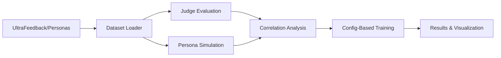

# Core Pipeline

This directory contains the core Multi-Judge Interpretability pipeline components. These are the fundamental building blocks used by all experiments.

## Quick Start

### Complete Experiment Pipeline

Use the main experiment script for end-to-end runs:

```bash
# Small scale test (10 samples, existing persona data)
python run_full_experiment.py --data-source personas --data-size 10 --dry-run

# Medium scale experiment (100 samples)  
python run_full_experiment.py --data-source personas --data-size 100

# Large scale with UltraFeedback (10k samples)
python run_full_experiment.py --data-source ultrafeedback --data-size 10000
```

## Structure

```
pipeline/
├── core/                       # Core pipeline components
│   ├── dataset_loader.py      # Load UltraFeedback and existing datasets
│   ├── judge_creation.py      # Create/manage judges via Martian API
│   ├── judge_evaluation.py    # Evaluate samples with judges
│   ├── persona_simulation.py  # Simulate human feedback personas
│   └── aggregator_training.py # Train GAM/MLP aggregation models
└── utils/                      # Shared utilities
    ├── judge_rubrics.py       # Full judge rubric definitions
    └── data_merger.py         # Data merging utilities
```

## Core Components

### 0. Dataset Loading (`dataset_loader.py`)
Loads datasets for experiments:
- **UltraFeedback**: 64k samples from HuggingFace
- **Existing Personas**: Previously processed data
- Creates experiment subsets and manages caching

```bash
# Load UltraFeedback dataset
python pipeline/core/dataset_loader.py --dataset ultrafeedback --n-samples 1000

# Load existing persona data  
python pipeline/core/dataset_loader.py --dataset personas
```

### 1. Judge Creation (`judge_creation.py`)
Creates and manages 10 specialized judges via Martian API:
- **Current Judges**: truthfulness, harmlessness, helpfulness, honesty, explanatory-depth, instruction-following, clarity, conciseness, logical-consistency, creativity
- Each judge evaluates on 1-4 scale
- Full rubrics in `utils/judge_rubrics.py`

```bash
python pipeline/core/judge_creation.py --list  # List all judges
python pipeline/core/judge_creation.py --update  # Update judge rubrics
```

### 2. Judge Evaluation (`judge_evaluation.py`)
Evaluates Q&A pairs using all judges:
- Parallel evaluation across 10 judges
- Checkpoint saving for large datasets
- Exponential backoff for API failures

```bash
python pipeline/core/judge_evaluation.py \
  --input dataset/data.pkl \
  --output dataset/data_with_scores.pkl \
  --max-workers 5
```

### 3. Persona Simulation (`persona_simulation.py`)
Simulates 14 diverse human personas:
- Professor, CEO, Novelist, Architect, Therapist, Parent, Student, Data Scientist, Child, Ethicist, Privacy Advocate, Skeptic, Engineer, Lawyer, Non-native Speaker
- Generates preference scores (1-10)
- Uses Lambda AI via OpenAI interface

```bash
python pipeline/core/persona_simulation.py \
  --input dataset/data.pkl \
  --output dataset/data_with_feedback.pkl \
  --max-concurrent 10
```

### 4. Aggregator Training (`aggregator_training.py`)
Trains models to combine judge scores with **config-based scaling**:
- **GAM**: Interpretable additive model  
- **MLP**: Neural network with automatic parameter scaling
- **Config-Based**: Automatic parameter selection based on dataset size
- **Scales**: small (<100), medium (100-1K), large (1K-10K), enterprise (>10K)
- Outputs trained model checkpoints

```bash
# Training with automatic config selection
python pipeline/core/aggregator_training.py \
  --data dataset/complete_data.pkl \
  --model-type mlp

# Manual parameter override
python pipeline/core/aggregator_training.py \
  --data dataset/complete_data.pkl \
  --model-type mlp \
  --mlp-hidden 128 \
  --mlp-epochs 150
```

**Config File**: `config/training_config.json`
- **Small Scale** (≤100): 32 hidden units, 50 epochs
- **Medium Scale** (100-1K): 64 hidden units, 100 epochs  
- **Large Scale** (1K-10K): 128 hidden units, 150 epochs
- **Enterprise Scale** (>10K): 256 hidden units, 200 epochs

## Run-Based Organization

All experiments now use **run-based organization** for complete tracking:

```
full_experiment_runs/
└── {data_source}_{size}samples_{timestamp}/
    ├── config.json              # Complete experiment configuration
    ├── experiment_results.pkl   # Final results 
    ├── experiment_summary.json  # Key metrics
    ├── data/                    # All experiment data
    │   ├── experiment_subset.pkl
    │   ├── data_with_personas.pkl
    │   └── data_with_judge_scores.pkl
    ├── results/                 # Analysis results
    │   ├── correlation_analysis.json
    │   └── model_results.json
    ├── logs/                    # Complete logging
    │   ├── main.log
    │   ├── debug.log  
    │   └── progress.log
    ├── plots/                   # Visualizations
    │   └── experiment_analysis.png
    └── checkpoints/             # API call checkpoints
        └── checkpoint_*.pkl
```

## Data Flow



## Usage in Experiments

### Main Experiment Script

```python
# Complete end-to-end experiment
python run_full_experiment.py --data-source ultrafeedback --data-size 1000

# Check results
ls full_experiment_runs/ultrafeedback_1000samples_*/
```

### Individual Components

```python
from pipeline.core.dataset_loader import DatasetLoader
from pipeline.core.judge_evaluation import JudgeEvaluator
from pipeline.core.aggregator_training import MLPTrainer, load_training_config

# Load data
loader = DatasetLoader()
data = loader.load_ultrafeedback(n_samples=100)

# Evaluate with judges
evaluator = JudgeEvaluator()
scores = evaluator.evaluate_dataset(data)

# Config-based training
config = load_training_config()
trainer = MLPTrainer(**config["mlp_training"]["medium_scale"])
```

## Configuration

Set environment variables in `.env`:
```bash
MARTIAN_API_KEY=your_key_here
OPEN_AI_API_KEY=lambda_api_key_here
```

## Data Format

All components use pandas DataFrames with these columns:
- `instruction`: Question/prompt  
- `answer`: Model response
- `judge_scores`: List of 10 scores (1-4 scale)
- `human_feedback`: Dict with persona scores and metadata
  - `personas`: Dict of 14 persona evaluations
  - `score`: Individual persona score (1-10 scale)
- `source`: Data source (ultrafeedback, personas, etc.)

## Best Practices

1. **Always use absolute imports** when importing from experiments
2. **Maintain backwards compatibility** when updating
3. **Document any API changes** in this README
4. **Use type hints** for better IDE support
5. **Keep components focused** - one responsibility each

## Testing Components

Test individual components:

```bash
# Test judge API connection
python pipeline/core/judge_creation.py --test

# Evaluate single sample
echo '{"instruction": "What is 2+2?", "answer": "4"}' | \
  python pipeline/core/judge_evaluation.py --stdin

# Quick training test
python pipeline/core/aggregator_training.py \
  --data dataset/data_with_judge_scores.pkl \
  --model-type mlp \
  --epochs 5 \
  --quick
```

## Component Dependencies

- `torch`: For model training
- `pandas`: Data manipulation
- `numpy`: Numerical operations
- `httpx`: Async API calls
- `martian-sdk-python`: Martian API client

## Extending the Pipeline

To add new components:
1. Create module in `pipeline/core/`
2. Follow existing patterns for data I/O
3. Add CLI interface for standalone use
4. Document in this README
5. Update experiments to use new component

## Version History

- **v1.0**: Initial refactored pipeline (Dec 2024)
- **v1.1**: Added standardized experiment structure  
- **v2.0**: Major pipeline upgrade (Aug 2025)
  - Added `run_full_experiment.py` main entry point
  - Implemented config-based MLP training with automatic scaling
  - Added `dataset_loader.py` for UltraFeedback integration
  - Updated to 10 current judges (truthfulness, harmlessness, etc.)
  - Expanded to 14 diverse personas
  - Implemented run-based organization system
  - Added comprehensive logging and checkpointing
  - Added automated visualization and correlation analysis